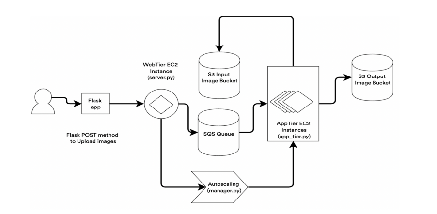

# AWS EC2 Auto-Scaling Image Recognition Service

This project provides an Infrastructure as a Service (IaaS) based image recognition service on AWS EC2, leveraging an AMI pre-loaded with a model for image classification. The service is designed to be auto-scalable based on the number of requests, ensuring rapid elasticity. 

## Table of Contents
- [Features](#features)
- [System Architecture](#system-architecture)
- [Installation and Setup](#installation-and-setup)
- [Testing](#testing)

## Features

- An image recognition service hosted on AWS EC2, using a pre-loaded model.
- Utilizes auto-scaling to handle variable loads. The service automatically scales up and down based on the number of requests in the input queue.
- Uses Amazon S3 buckets for storage of input images and output results.
- Input queue request handling through SQS, feeding a sequence pool to the IaaS application.
- Test cases included to run benchmarks.

## System Architecture

  
*Add your architecture diagram here*

## Installation and Setup

The project is composed of multiple Python scripts responsible for different tasks such as interfacing with AWS EC2, SQS, and S3. You will need to have AWS CLI configured with your credentials to access your AWS resources.

For detailed information about the code, please refer to the `project_report.pdf` in the repository.

*Provide step by step setup instructions here*

## Testing

Initial testing was performed by using Postman to send a single picture as part of an HTTP request to test the web-tier endpoint. It was then scaled up to handle 10, 20, 30, and finally 100 concurrent requests. After this, the auto-scaling feature was tested and validated to accurately process 100 concurrent requests in just under a minute.
